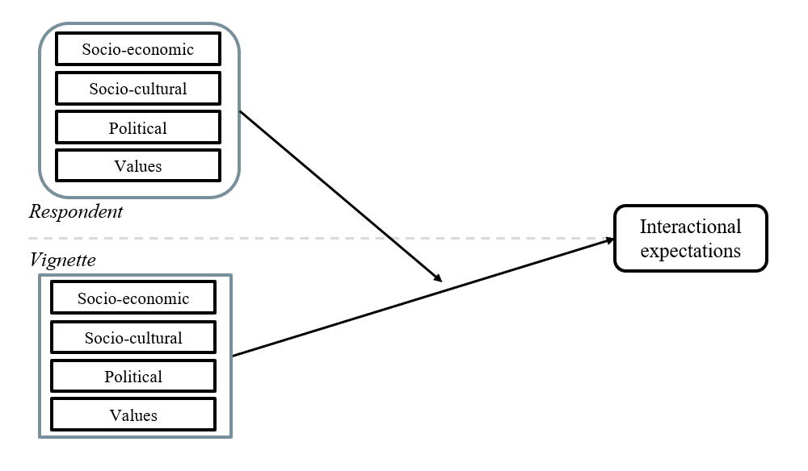

## Theoretical perspectives on social cohesion

### Social Cohesion 

::: {.fragment fragment-index=1}
* It can be understood as a state of affairs relating to interactions: **vertical** (between individuals and major institutions) and **horizontal** (between individuals and groups).
:::

::: {.fragment fragment-index=2}
> (..) characterized by a set of attitudes and norms that include trust, a sense of belonging, and a willingness to participate and help, as well as their behavioral manifestations [@chan_reconsidering_2006]. 
:::

::: {.fragment fragment-index=3}
* Identifying (i) **shared and conflicting interests**, (ii) **goals**, and (iii) **values** leads to the identification of opportunities for cooperation motivated by bonds of trust and support within your local or national community [@green_regimes_2011].
:::

## Contextual factors of social cohesion

::::: {.columns style="font-size: 85%;"}
:::: {.column width="50%"}

::: {.incremental}

***Contextual characteristics***

* Social cohesion research distinguishes constituent elements from their causes, but theoretical mechanisms remain domain-specific and are not integrated into a comprehensive framework. 

* Three domains shape horizontal cohesion at the aggregate level:

  * **Socioeconomic**: affluence strengthens cohesion; inequality weakens it by segregating social relations and reducing perceived commonalities
  * **Sociocultural**: diversity effects are modest and context-dependent, operating through contact (familiarity) or conflict (threat) mechanisms
  * **Values**: self-transcendence and openness promote cohesion; value polarization erodes it

:::

::::
:::: {.column width="50%"}

::: {.incremental}

***The scale of analysis***

* Common limitation across all three domains: mechanisms are inferred at the aggregate level, not studied at the level of interactions between individuals.
  
* This study **scales down** to the micro-level, focusing on how individuals form positive interactional expectations toward others across (i) socioeconomic, (ii) sociocultural, and (iii) value/ideological *social positions*.

:::
:::::
::::


## Theoretical perspectives on social cohesion

### Social positions
::::: {.columns style="font-size: 70%;"}

:::: {.column width="50%"}

***Objective positions***

::: {.incremental}

* Based on Blau's structural approach, social positions are defined by population distributions across social parameters [@blau_macrosociological_1977].
* Two parameter types organize objective positions:
  * **Nominal**: group boundaries (e.g., race, religion).
  * **Graduated**: ranked status dimensions (e.g., income, education).
* These produce two key structural properties:
  * **Heterogeneity** (dispersion across categories).
  * **Inequality** (status disparity across ranks).

* Weakly correlated, intersecting parameters can foster intergroup ties; strongly correlated parameters reinforce boundaries [@blau_macrosociological_1977].
* Objective structure captures opportunities for association while excluding preferences, norms, and values.
  
:::

::::

:::: {.column width="50%"}

***Subjective positions***

::: {.incremental}

* Beyond objective structure, social cohesion research highlights **subjective positions**: values and worldviews shaping association patterns.
* Cultural stratification links status with value-based distinctions in social milieus [@groh-samberg_social_2023].
  
* Values are enduring motivational orientations, distinct from attitudes, and guide social evaluation [@kulin_class_2013].

* Basic Human Values theory structures value orientations into broader motivational domains [@schwartz_universals_1992; @schwartz_individualism_1994].

* Ideological worldviews also matter: left-right alignments shape perceived proximity, trust, and expected interaction [@sartori_politics_1969; @hjermitslev_beyond_2026].

* Cohesion therefore is affected not only by structural location, but also by perceived values and ideological alignment [@deitelhoff_social_2023; @grunow_social_2023].

:::

::::

:::::

## Promoting and inhibiting forces of social cohesion

### Socioeconomic positions

::: {.incremental .highlight-last style="font-size: 100%;"}

* Economic **affluence** tends to strengthen cohesion, while **inequality** weakens it [@delhey_social_2023].

* Inequality increases social distance and segregation, reducing shared fate and opportunities for interaction across status groups [@pichler_social_2009; @uslaner_inequality_2005].

* SES cues activate dual mechanisms: status/competence (higher SES can raise trust) and social distance (higher SES can reduce perceived closeness) [@fiske_facing_2012; @ridgeway_why_2014].
  
* Effects are context-dependent: under high inequality, high-income profiles may trigger distance or threat rather than trust [@salgado_expectations_2021].

:::

## Promoting and inhibiting forces of social cohesion

### Sociocultural positions

::: {.incremental .highlight-last style="font-size: 100%;"}

* Sociocultural **heterogeneity** has mostly modest and context-dependent effects on cohesion, shaped by local inequality and boundary structures [@baldassarri_diversity_2020; @koopmans_relational_2015].
 
* Migration cues affect expectations through two competing mechanisms: perceived **threat/competition** versus positive **contact/familiarity** [@hainmueller_hidden_2015; @hewstone_consequences_2015].

* In this framework, migration background is often judged through perceived contribution and integration into shared social life [@castillo_social_2023].

* Religious cues operate more through symbolic fit with social norms and values, so effects depend on the form and meaning of religiosity in context [@rowatt_dimensions_2021; @moon_religious_2018].

:::

## Promoting and inhibiting forces of social cohesion

### Value and ideological positions

::::: {.columns}
:::: {.column width="40%"}

::: {.fragment fragment-index=1 style="font-size: 80%;"}
* Societies with greater degree of shared values show higher levels of social trust, suggesting that common goals are promoted by similarity in human value orientation [@beilmann_social_2015].
:::
::: {.fragment fragment-index=2 style="font-size: 80%;"}
* They function as evaluation criteria, so certain value profiles can promote or inhibit cohesion [@groh-samberg_social_2023].

* Values transcend specific actions and situations. Distinguishing them from norms and attitudes that usually refer to specific actions, objects, or situations [@schwartz_universals_1992]

:::
::::


:::: {.column width="60%"}
::: {.fragment fragment-index=3 style="font-size: 50%;"}

* According to the theory of basic human values [@schwartz_universals_1992], values can be divided into four conflicting higher-order values

```{r , echo=FALSE, out.width="80%"}
knitr::include_graphics("images/humanvalues2.jpeg")
```
:::
::::
:::::

## Promoting and inhibiting forces of social cohesion

### Value and ideological positions

::: {.incremental .highlight-last style="font-size: 100%"}

* Political preferences are socially meaningful cues through which conflict and coordination are organized in democratic life [@grunow_social_2023].

* Ideological positions shape interaction expectations through social identity and perceived political distance [@hernandez-lagos_political_2020; @balliet_political_2018].

* The **left-right** spectrum works as a symbolic map of group belonging, affecting perceived trustworthiness and openness to reciprocity [@hernandez-lagos_political_2020; @groh-samberg_social_2023].

* Perceptions of **centrists** as more accessible are context-dependent: where ideological conflict is intense, moderate positions can be seen as less conflictive [@hernandez-lagos_political_2020; @grunow_social_2023].

:::

## Summary 

::: {.incremental}

1. Social cohesion is a characteristic of a social unit, but it is defined in terms of the social interactions within it. 

2. Social interactions within the unit are the constituent elements of social cohesion. 

3. The characteristics of the social unit, such as inequality, heterogeneity, and institutions (formal or informal), are understood as explanatory factors of cohesiveness, since they affect social interactions. 

4. This study focuses on the **horizontal dimension** of social cohesion. Particularly, the individual **expectations** toward different social positions as a constitutive element in the formation of social associations. 

:::


# How are different social positions linked to positive interactional expectations, and to what extent does similarity in social position affect them? {background-color="#491106ff"}

## This Study

::: {.r-stack}
{.fragment .fade-in fig-align="center" width="1000px}

:::


