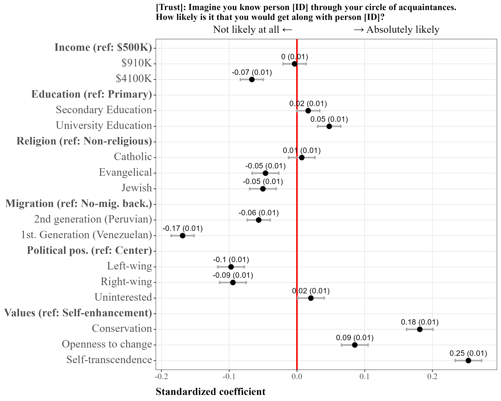
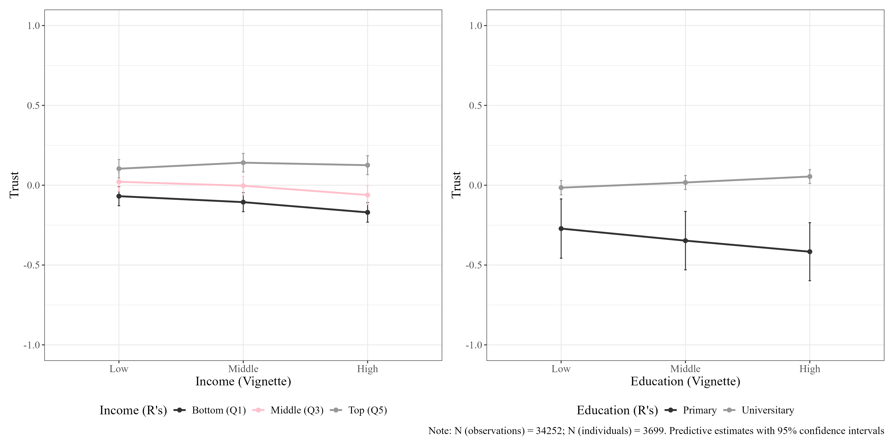
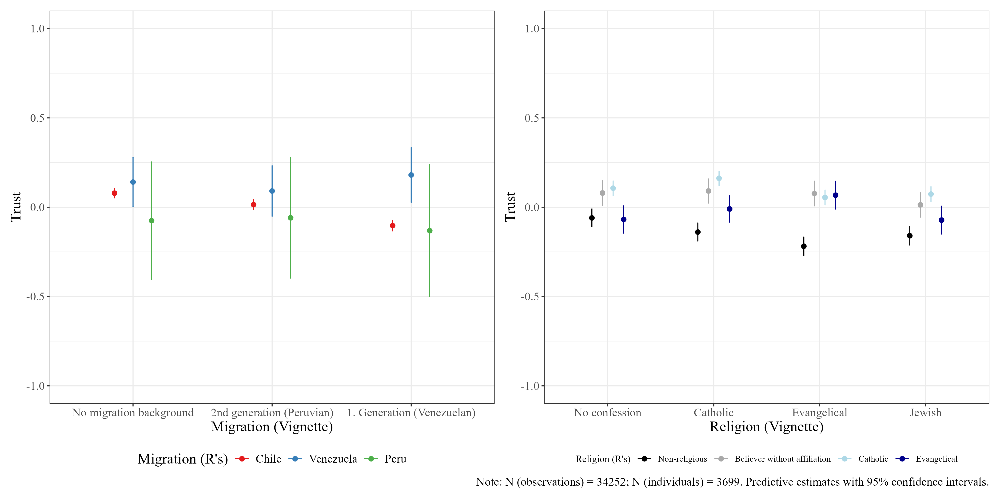
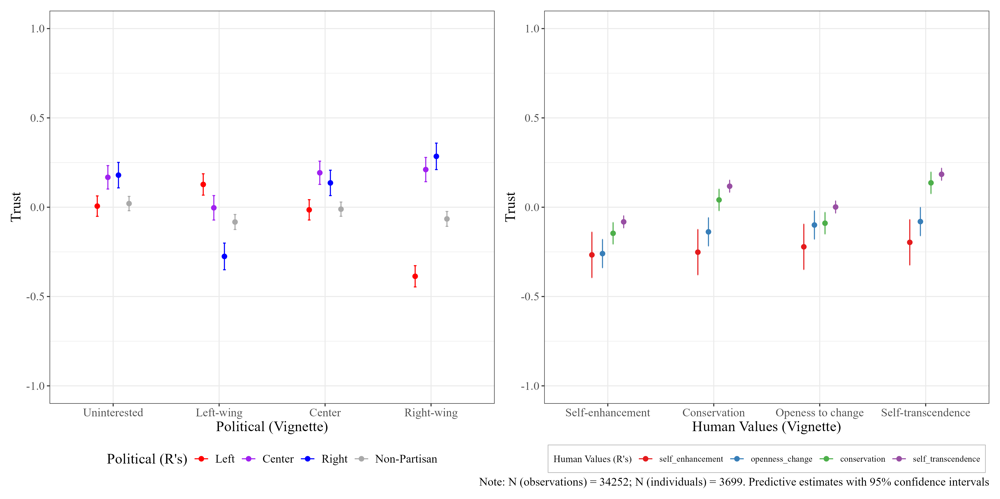

# Results {background-color="#491106ff"}

## Social positions and social cohesion

```{r , echo=FALSE, out.width="75%"}

```

## Cross-group interactions (SES)

```{r , echo=FALSE, out.width="100%"}

```

## Cross-group interactions (SC)

```{r , echo=FALSE, out.width="100%"}

```

## Cross-group interactions (Pol-Val)
```{r , echo=FALSE, out.width="100%"}

```

