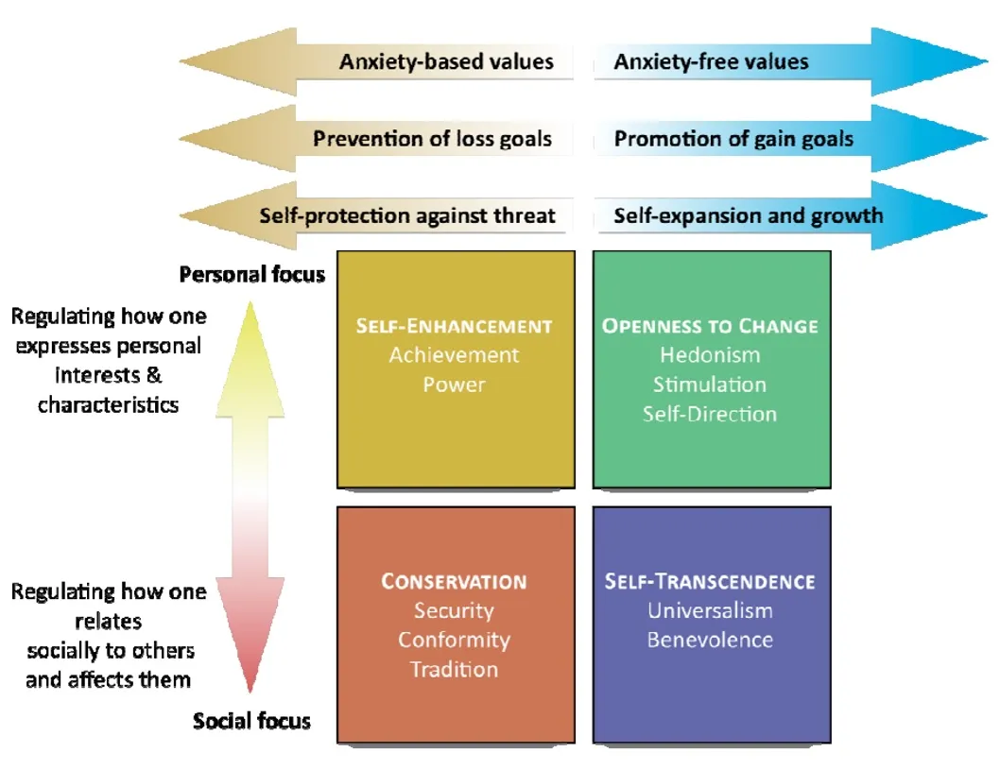
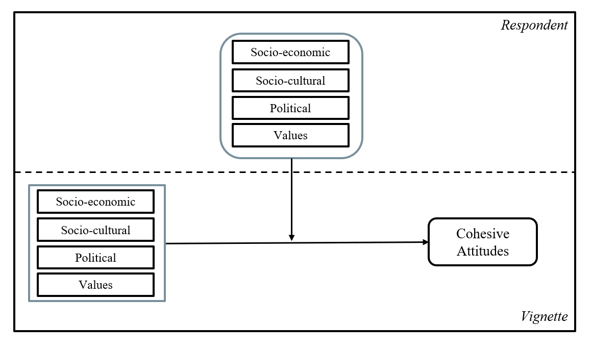

## Theoretical perspectives on social cohesion

### Social Cohesion 

::: {.fragment fragment-index=1}
* It can be understood as a state of affairs relating to interactions: **vertical** (between individuals and major institutions) and **horizontal** (between individuals and groups).
:::

::: {.fragment fragment-index=2}
> (..) characterized by a set of attitudes and norms that include trust, a sense of belonging, and a willingness to participate and help, as well as their behavioral manifestations [@chan_reconsidering_2006]. 
:::

::: {.fragment fragment-index=3}
* Identifying (i) **shared and conflicting interests**, (ii) **goals**, and (iii) **values** leads to the identification of opportunities for cooperation motivated by bonds of trust and support within your local or national community [@green_regimes_2011].
:::

## Theoretical perspectives on social cohesion

### Cohesion between and within groups

::: {.fragment fragment-index=1}

* Attitudinal and behavioral expressions contribute to the formation of groups.

*  socioeconomic position (vertical distinctions) and shared world views, values or beliefs (horiztontal distinctions) [@groh-samberg_social_2023]
:::

::: {.fragment fragment-index=2}

* individuals are integrated into groups, and these are integrated (more or less) into society.  
    * **Internal** (within): similarity can promotes trust, consensus, and cooperation. 
    * **Intergroup** (between): existence of ties between groups and institutions that mediate and contain value or economic conflicts. 
:::

## Promoting and inhibiting forces of social cohesion

### Socioeconomic domain

::: {.incremental .highlight-last style="font-size: 100%;"}

* Economic **inequality** can be "corrosive" to social cohesion [@delhey_social_2023]. As individuals are set apart by economic distance this breeds greater social distance, reduce chances of encounter and knowing others' world views [@otero_lives_2022]. 

* Socioeconomic differences can draw symbolic boundaries of "respectability" and "distinction"[@groh-samberg_social_2023, p.315] associated with lower trust in others [@diprete_segregation_2011]. 

* Advantaged positions are associated with lower perceived risks in exchange situations, which would explain a greater willingness to trust others [@fiske_facing_2012]. 
  
* As cooperation partners, people with high SES (education and income) are perceived as more competent, in contrast to individuals with lower SES [@salgado_expectations_2021]

:::

## Promoting and inhibiting forces of social cohesion

### Sociocultural diversity domain

::: {.incremental .highlight-last style="font-size: 100%;"}
* Sociocultural **heterogeneity** defined by differences in ethnic, religious, or national origin can tension social cohesion [@baldassarri_diversity_2020]. 
 
* Migrants may be perceived as an economic **threat**, associated with increased perceived labor or cultural competition, linked to the loss of national identity [@castillo_social_2023]. However, positive **contact experiences** are also linked to lower prejudge towards migrants [@hewstone_consequences_2015]

* Religiosisty can also be perceived as a symbol of adherence to social norms and values  [@rowatt_dimensions_2021]. Religious people may be perceived as slow planners, non-impulsive, and more trustworthy than non-religious people [@moon_religious_2018]. 

:::

## Promoting and inhibiting forces of social cohesion

### Value domain

::::: {.columns}
:::: {.column width="40%"}

::: {.fragment fragment-index=1 style="font-size: 80%;"}
* Societies with greater degree of shared values show higher levels of social trust, suggesting that common goals are promoted by similarity in human value orientation [@beilmann_social_2015].
:::
::: {.fragment fragment-index=2 style="font-size: 80%;"}
* They function as evaluation criteria, so certain value profiles can promote or inhibit cohesion [@groh-samberg_social_2023].

* Values transcend specific actions and situations. Distinguishing them from norms and attitudes that usually refer to specific actions, objects, or situations [@schwartz_universals_1992]

:::
::::


:::: {.column width="60%"}
::: {.fragment fragment-index=3 style="font-size: 50%;"}

* According to the theory of basic human values [@schwartz_universals_1992], values can be divided into four conflicting higher-order values

```{r , echo=FALSE, out.width="80%"}

```
:::
::::
:::::

## Promoting and inhibiting forces of social cohesion

### Political Domain

::: {.incremental .highlight-last style="font-size: 100%"}

* Political preferences, which encompass worldviews about relevant economic or cultural topics, are expressed in (democratic) conflicts within the political community and its institutions [@grunow_social_2023].    

* Ideological positions affect social evaluations while political *identity* determines perceptions of trustworthiness and openness to reciprocity [@groh-samberg_social_2023]. 

* Individuals evaluate political positions on a **left-right** spectrum that traces the identities of political groups [@hernandez-lagos_political_2020].

* **centrists** (when compared) are often perceived as more moderate, open to compromise, and less extremist, making them more accessible to people from diverse political backgrounds [@hernandez-lagos_political_2020]

:::

## Summary 

* Social cohesion is a characteristic of a social unit, but it is defined in terms of the social interactions within it. 

* Social interactions within the unit are the constituent elements of social cohesion. 

* The characteristics of the social unit, such as inequality, heterogeneity, and institutions (formal or informal), are understood as explanatory factors of cohesiveness, since they affect social interactions. 

* This study focuses on the **horizontal dimension** of social cohesion. Particularly, the individual (*subjective*) **expectations** toward different social positions as a constitutive component in the formation of social associations within and between groups. 


# How do the characteristics of social groups affect social cohesion? {background-color="#491106ff"}

## This Study

::: {.r-stack}
{.fragment .fade-in fig-align="center" width="1000px}

:::


